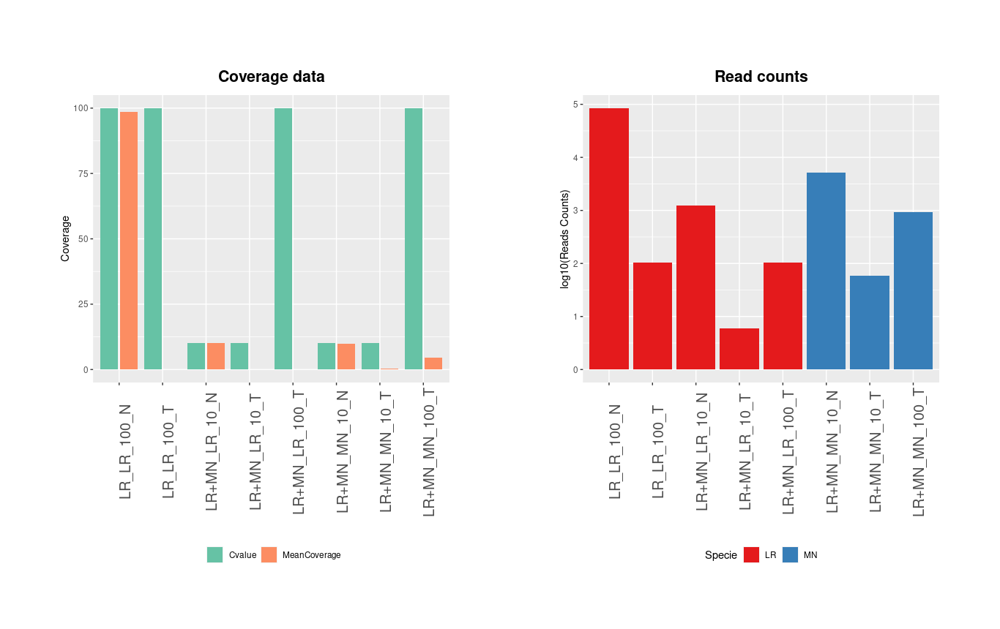

<!--

The paper.md, bibtex and figure file can be found in this repo:

  https://github.com/journal-of-research-objects/Example-BioHackrXiv-Paper

To modify, please clone the repo. You can generate PDF of the paper by
pasting above link (or yours) in

  http://biohackrxiv.genenetwork.org/

-->

# Introduction

Wastewater-Based Epidemiology (WBE) holds significant promise as an early-warning system for various pathogens, with the potential to contribute to public health ([@choi_2018], [@spurbeck_2021]). While considerable wet-lab efforts have been dedicated to this field, its limits and actual potential remain undefined when viewed from a dry-lab perspective.

Wastewater influent into a Wastewater Treatment Plant (WWTP) is a complex mixture of sewage from the catchment area, encompassing a diverse array of nucleic acid originating from Eukaryotic, Prokaryotic, and Viral organisms. Although the precise composition of wastewater remains poorly documented, it has been established that these microbial communities are highly fragmented ([@ho_2022])). Additionally, Viral organisms are found in lower relative abundance compared to their Prokaryotic counterparts, primarily due to their smaller genomic size. These characteristics pose unique challenges for dry-lab and bioinformatic analysis.

Furthermore, the variability of wastewater samples across seasons, geographical locations, and days of the week adds another layer of complexity. The choice of wet-lab preparation methods and High Throughput Sequencing (HTS) techniques has been shown to impact the detection of specific microorganisms ([@polo_2020]. Taking all of these components into account, it is clear that there are likely challenges in detecting and characterising the ground-truth in this sample type. 

As a response to these challenges, our biohackathon project is dedicated to exploring the potential of WBE in addressing specific biological questions. Our approach involves reviewing metadata associated with various read archives wastewater sequencing data uploads and developing a prototype workflow to assess the accuracy of Antimicrobial Resistance (AMR) detection in wastewater. This research aims to shed light on the full capabilities and limitations of Wastewater-Based Epidemiology from a dry-lab perspective. The end-goal is a workflow that permits novice users to establish the probability of detecting their specific ground-truth in a shotgun metagenomics wastewater sequencing dataset.

# Metadata standards for wastewater HTS data upload

## Raw sequencing data

To collectively address the challenge of harmonizing metadata for NGS data generated from sequencing wastewater samples across major deposition databases (such as SRA and ENA), we conducted a community survey. The objective of this survey was to identify the essential metadata that should be included during the deposition of NGS data and to establish a common alignment point. The [survey]((https://ec.europa.eu/eusurvey/runner/ELIXIR-BH2023-Project31)) featured questions adapted from the ENA checklist (please note that these questions are a slight modification of the ENA checklist available at [link](https://www.ebi.ac.uk/ena/browser/view/ERC000036)). The questions can be viewed in the table below. 

Number |  Metadata name |  Metadata Description |  Metadata Type 
-----------|------------------------|--------------------------------|---------------------
1 | Name of the sampling site |  Refers to the name of the site/station where data/sample collection is performed | Free text
2 | Nucleic acid extraction |  A link to a literature reference, electronic resource or a standard operating procedure (SOP), that describes the material separation to recover the nucleic acid fraction from a sample. | Free text
3 | Nucleic acid amplification |  A link to a literature reference, electronic resource or a standard operating procedure (SOP), that describes the enzymatic amplification (PCR, TMA, NASBA) of specific nucleic acids |  Free text
4 | Investigation type | Nucleic Acid Sequence Report is the root element of all MIxS compliant reports as standardised by Genomic Standards Consortium | one of the: bacteria-archaea, eukaryote, metagenome, metagenome-assembled genome, metatranscriptome, mimarks-specimen, mimarks-survey, organelle, plasmid, single amplified genome, uncultivated viral genomes, virus
5 | Surveillance target | Valid species level NCBI taxon id of the organism being surveyed for (if any) e.g. for Escherichia coli enter 562. |Ontology choice (e.g. ncbitaxon)
6 | Collection date | The date the sample was collected with the intention of sequencing, either as an instance (single point in time) or interval. In case no exact time is available, the date/time can be right truncated i.e. all of these are valid ISO8601 compliant times: 2008-01-23T19:23:10+00:00; 2008-01-23T19:23:10; 2008-01-23; 2008-01; 2008. | Date
7 | Geographic location (country and/or sea) | The location the sample was collected from with the intention of sequencing, as defined by the country or sea. Country or sea names should be chosen from the INSDC country list (http://insdc.org/country.html). | Country code/list
8 | Geographic location (latitude) |  The geographical origin of the sample as defined by latitude. The values should be reported in decimal degrees and in WGS84 system | Number
9 | Geographic location (longitude) | The geographical origin of the sample as defined by longitude. The values should be reported in decimal degrees and in WGS84 system | Number
10 | Geographic location (region and locality) | The geographical origin of the sample as defined by the specific region name followed by the locality name. | Free text
11 | Amount or size of sample collected | The total amount or size (volume (ml), mass (g) or area (m2) ) of sample collected | Number
12 | Sample storage duration | duration for which sample was stored | Number
13 | Sample storage temperature | temperature at which sample was stored, e.g. -80 | Number
14 | Sample storage location | location at which sample was stored, usually name of a specific freezer/room | Free text
15 | Sampling time point | Sampling time point | Free text
16 | Sample transportation temperature | transportation temperature from sample site to storage | Number
17 | Sample transportation date | transportation/shipping date of the sample. Format:YYYY-MM-DD | Regular expression
18 | Sample transportation time | transportation time from sample site to storage | Number
19 | Receipt date | Date on which the sample was received. Format:YYYY-MM-DD. Please provide the highest precision possible. If the sample was received by the institution and not collected, the 'receipt date' must be provided instead. Either the 'collection date' or 'receipt date' must be provided. If available, provide both dates. | Regular expression
20 | Sewage type | Type of sewage based on origin. | one of the: wastewater treatment plant (municipal or industrial), open sewer line, river, stream, stagnant pool, or other
21 | Temperature | temperature of the sample at time of sampling | Number
22 | Area of sampling site | Please indicate if there are specific facilities in the area covered by the sewage sample. For example: farming, slaughterhouse(s), industry, hospital(s) or any other facility. | Free text
23 | Size of the catchment area | Refers to the size of the area that is drained by the sampled sewage system in square km. | Number
24 | Population size of the catchment area | Refers to the number of people living in the area covered by the sewage system | Number

For each metadata, an indication of whether it’s considered **necessary**, **optional** (i.e. good to have but not critical), or **not required** (i.e. don’t care / don’t need) is expected. Finally, there is the option of adding, as structured text, any other metadata that might be considered in the form of `<metadata name>:<metadata description>:<required/optional>`.

## Wastewater analysis results

We have compiled a list of critical information that we consider essential for facilitating a thorough comparison of wastewater analysis results and evaluating the robustness and reproducibility of wastewater workflows. These key metadata points include:

- Amplicon probe map (version) (e.g., inserts or primers bedfile)
- Quality control measures performed (e.g., filters applied to raw reads, inclusion of read deduplication steps, which can impact variant calling)
- Sequencing coverage
- Variant caller used (e.g., GATK4 HaplotypeCaller, which cannot call variants with Allele Frequency < 0.5, versus LowFreq, which can, but has higher false positive rates, and ShoRAH/VILOCA, known for its resilience at low frequencies)
- Version of the lineages database used (relevant if Pangolin, Freyja, or other tools were employed)

# LIMBO - Low Input Microbial Biological Observations workflow
Working with wastewater sequencing data poses a significant challenge: determining the level of detection confidence based on the frequency and coverage of microbial presence. In response to this challenge, we introduce the LIMBO workflow, a versatile tool that allows users and analysts to explore scenarios of low-input microbial presence while evaluating classification accuracy. The workflow includes taxonomic classification, detection of Single Nucleotide Variants (SNVs), and identification of novel taxa, variants, and lineages. The primary outcome is a quantifiable measure of ground-truth as a probability.

## Case Study: Antimicrobial Resistance Detection
In this prototype, we focus on the application of LIMBO to shotgun metagenomics sequencing of wastewater for Antimicrobial Resistance (AMR) detection.

### Simulation of HTS Data

Use a synthetic simulation tool such as MeSS ([@mess_2023]) or NEAT ([@neat_2016]) to simulate High-Throughput Sequencing (HTS) data.

We _in-silico_ simulated 5 datasets using NEAT (v.3.2). 2 datasets were composed by only E. coli (LR882973.1, abbreviated with LR) reads while the remaining 3 datasets were composed by a mixed population or reads belonging to both E.coli and SARS-CoV-2 (MN908947.3, abbreviated with MN). Full list of parameters used are shown in the table below. To simulate targeted sequencing for SARS-CoV-2 samples, a bed file containing the ARTIC v.3 amplicon panel was used. To simulate a targeted sequencing approach for E. Coli, random regions were selected.

InputSpecie|TargetedCvalue|ReadLength|FragmentLength|FragmentSD
-----------|--------------|----------|--------------|----------
LR+MN|T|100|150|500|5
LR+MN|T|10|150|500|5
LR+MN|N|10|150|500|5
LR|N|100|150|500|5
LR|T|100|150|500|5

Raw reads were next mapped vs the relative reference genomes. Metrics and statistics were evaluated with the SAMtools toolkit (samtools coverage, samtools depth).

### Replicate Generation

> Optionally, generate multiple replicates from the same input set using a normal distribution and a standard deviation parameter.

### Post Sequencing Processing

> Depending on the type of sequencing input (e.g., shotgun metagenomics), apply the appropriate post-sequencing processing methods, such as alignment approaches and SPAdes assembly.

> Conduct end-point detection of AMR genes and plasmids using tools like AMRFinderPlus, Abricate, and CARD.

### Output

> Obtain the probability of successfully obtaining ground-truth data.

### Justification:

The LIMBO workflow addresses a critical need in the field of wastewater based epidemiology. It provides a systematic approach for assessing the accuracy of microbial detection under various conditions. By simulating HTS data and evaluating classification accuracy, LIMBO will empowers researchers to make informed decisions and enhances the reliability of results. 

# Results

## Metadata survey (preliminary) analysis

The survey was circulated across various networks, including the [ELIXIR 
Wastewater Surveillance Working Group](https://www.covid19dataportal.org/partners?activeTab=Working%20groups), as well as through social media, receiving approx. 25 responses within 48 hours. A preliminary analysis of these results yield the following insights:

1. There is significant variation in the perception of the significance of the various metadata fields, with the vast majority of them fluctuating between **necessary** and **optional**.
2. `Collection date` (100%), `Geographic location (country and/or sea)` (80%) and `Sewage type Description` (80%) had the strongest indicators, with over 80% of the responses identifying them as **necessary**.
3. No metadata were consistently identified as **not required**. `Sample storage location` had the strongest response in this category with 44% responding as such, followed by `Sample transportation time` (32%), `Receipt date` (32%) and `Sample transportation date` (28%).

Finally, the following additional metadata were suggested (grouped conceptually per theme):

**Reporters**

- `authors: those contributing to the sample prep and processing: optional`
- `collecting lab: lab in charge of sample collection: required`
- `reporting lab: lab in charge of processing the sample and performing sequencing (or outsourcing it): required`
- `sequencing lab: if different from reporting lab, facility where sequencing was performed: optional`
- `lab: lab(s) where the samples were analysed:optional`

**Library Prep**

- `sequencing purpose: e.g. surveillance : required`
- `library preparation kit: kit to prepare sample for sequencing: required`
- `sequencing technology: sequencer name: required`

**Water stuff**

- `catchment geography:a geojson file describing the catchment area:optional`
- `residence time: average/majority time samples take from shedding to the sampling site: necessary`
- `flow: daily flow volume of wastewater upstream from the sampling site:optional`
- `WaterFlow: Volume of WW processed by the plant during the sampling date:required`
- `RainData: mean/median (?) volume of rain (mL/cm2) from the catchment area. It can affect sensitivity: optional`
- `WaterFlow:Volume of WW processed the day of that sampling: required`
- `sampling approach: e.g. 24h autosampler, passive sampler, grab sampling: necessary`
- `normalization_markers: proxies for human fecal shedding such as oxygen, nitrogen concentration, or PmmV:optional`

**NGS data**

- `sample name: some name give to the sample (any guidelines?): required`
- `raw dataset embargo: if raw dataset should be openly shared only after some embargo date: optional`
- `quality_flag: possibility to flag entries as low quality/invalid:optional`

## LIMBO 

### NEAT HTS simulation tool

We started to test the possibility of using NEAT, a synthetic simulation tool, to create in-silico wastewater datasets. In particular, we focused our attention on the possibility on simulating targeted sequencing approaches while using multifasta files as input. We evaluated the ability of NEAT to produce the requested coverage values under several conditions (presence/absence of targeted data, presence of single/multiple species as input). We found that NEAT did not result in the expected coverage values when a targeted sequencing approach was simulated, with both single or multiple species used as input.

**Figure 1**: NEAT results. Labels: Input(LR/LR+MN)_Specie(LR/MN)_CoverageRequested(10/100)_Targeted(T/N). A) Coverage results with respect to Coverage requested. Mean Coverage was evaluated with the samtools coverage command from the SAMtools toolkit. B) Reads total counts per dataset as evaluated by samtools flagstat. 

Input|Specie|Targeted|Nreads|CoveredBases (Kbp)|PercCovered|Cvalue|MeanCoverage|MeanBaseQ|MeanMapQ|HistBinWidth (bp)|HistoMaxBin (%)
-----|------}--------|------|------------------|-----------|------|------------|---------|--------|-----------------|----------------
LR+MN|MN|Yes|930|25.7|85.92|100|4.66|34.3|60|139|100
LR+MN|LR|Yes|104|5.6|4.349|100|0.121|34.3|60|603|97.181
LR+MN|MN|Yes|58|11.2|37.3|10|0.485|34.3|60|139|100
LR+MN|LR|Yes|6|1.5|1.157|10|0.0116|34.4|60|603|73.466
LR+MN|MN|No|5090|129.1|99.96|10|9.85|34.3|59.6|603|100
LR+MN|LR|No|1224|29.5|98.7|10|10.2|34.3|60|139|100
LR|LR|No|84826|129.1|99.99|100|98.5|34.3|59.4|603|100
LR|LR|Yes|104|5.6|4.302|100|0.121|34.3|60|603|98.01

[**Table 1**: Samtools coverage results are displayed for each NEAT-created dataset. Results are split by species.][table1]

### MeSS HTS simulation 

The Metagenomic Sequence Simulator (MeSS) is a snakemake workflow used for simulating metagenomic mock communities. We tried to simulate HTS data with MeSS and encouterered some specific challenges. First and foremost Challenges:
- Documentation is lacking, template and example have diverged from code. No configuation validation
- Does not rely on snakemake’s automatic handling of dependencies
- MeSS is based on the taxonomic queries which do not fit the needs for Virus specific sequencing, need a more flexible approach for data input. 
- Only permits fetching from NCBI, missing some important QC criteria in other databases such as GTDB

- Does it work? 
  - It runs on each species present and assembles and shuffles results to an output file
  - Number of reads do fit user request

### Incorporating MeSS within user defined metagenomic survey 

- New generator of input data for MeSS 
- Make a prototype that can take a arbitrary set of queries and avoid NCBI tax ID issues
- Outputtting fastq files, not including their reporting

# Discussion 

With regards to wastewater sequencing archives metadata, users have a variety opinions on the necessary or optional data points. The issue is to bring data sharers on board with any updates to required metadata as different studies may not collect the same data points. The Elixir Wastewater COVID-19 working group will be used to facilitate future conversations around this results? Secondary to this is the identification of minimum reporting standards for wastewater based epidemiology (MIWPE). A formal statement from the community through scientific consortiums or publications could established MIWBE for future publications and this data could be captured as part of the SRA/ENA upload process. 

## Acknowledgements

Some of the authors were funded by ELIXIR, the research infrastructure for life-science data, to join the BioHackathon Europe.

## References
